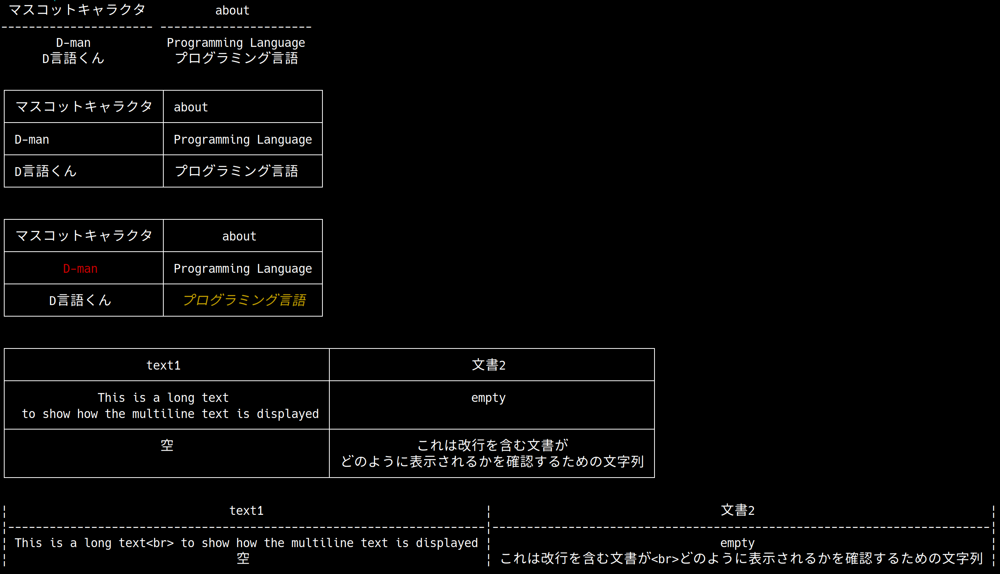

# tabletool

[](https://github.com/nonanonno/tabletool/actions/workflows/test.yml)
[](https://code.dlang.org/packages/tabletool)

A table generator library inspired by Python's tabulate  compatible with east-asian character.

```d
import std.stdio;
import tabletool;

// Basic
const data = [
    ["D-man", "Programming Language"],
    ["D言語くん", "プログラミング言語"],
];
const header = ["マスコットキャラクタ", "about"];
writeln(tabulate(data, header), "\n");

// Also works with struct
struct Data
{
    @DisplayName("マスコットキャラクタ")
    string name;
    string about;
}

const structData = [
    Data("D-man", "Programming Language"),
    Data("D言語くん", "プログラミング言語"),
];

writeln(tabulate(structData, Config(Style.grid, Align.left, true)), "\n");

// Also works for colored data
const coloredData = [
    Data("\033[31mD-man\033[0m", "Programming Language"),
    Data("D言語くん", "\033[33m\033[3mプログラミング言語\033[0m"),
];

writeln(tabulate(coloredData, Config(Style.grid, Align.center, true)), "\n");

// Also works for multiline data
const multilineData = [
    [
        "This is a long text\n to show how the multiline text is displayed",
        "empty"
    ],
    [
        "空",
        "これは改行を含む文書が\nどのように表示されるかを確認するための文字列"
    ],
];

writeln(tabulate(multilineData, ["text1", "文書2"], Config(Style.grid)), "\n");

// <br> is used instead for marudown
writeln(tabulate(multilineData, ["text1", "文書2"], Config(Style.markdown)), "\n");
```



See [example](./example) for executable example.

## Features

- Compatible with east-asian characters (Thank to [east_asian_width](https://code.dlang.org/packages/east_asian_width))
- Generate a table from 2-D array of any element which can be converted to string
- Generate a table from 1-D array of a struct (Can override display name by UDA `@DisplayName("<name>")`)
- Generate a table from 1-D array of an associated array whose key and value can be converted to string
- Configure table appearance (style, alignment)
- Turn on/off header
- Handle bash color sequence
- Multiline text